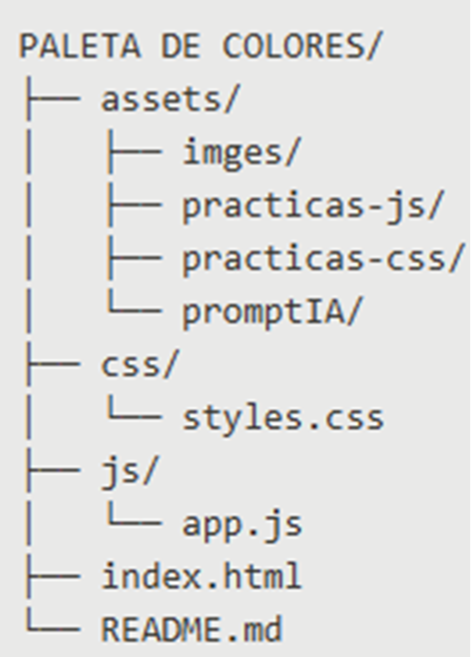
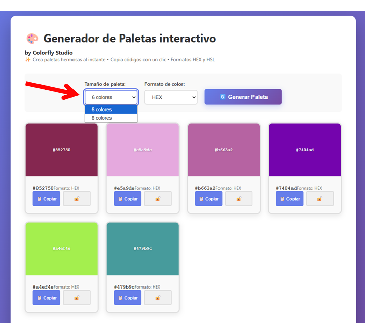
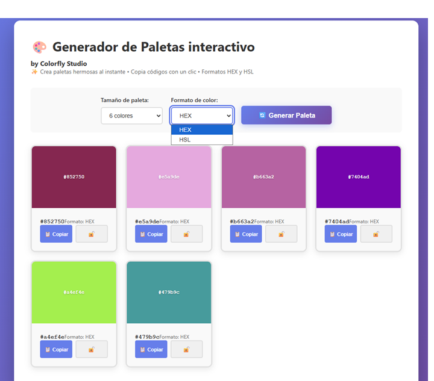
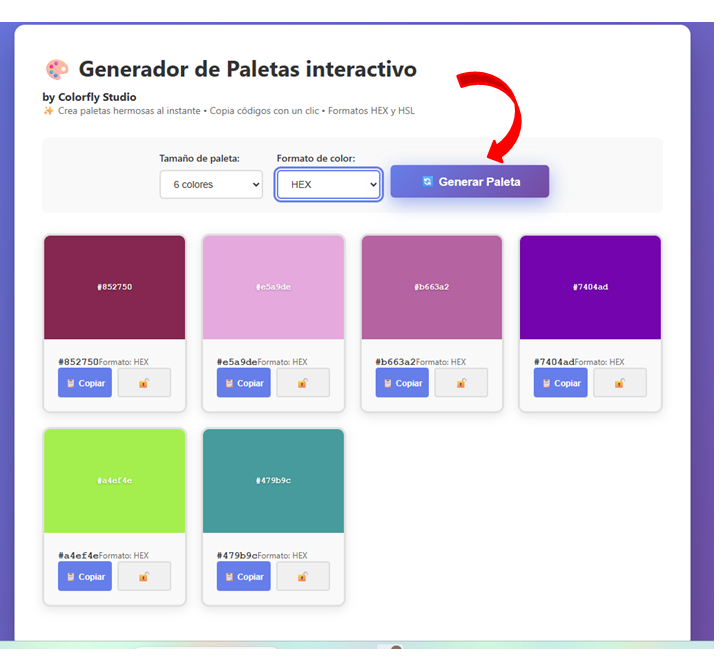
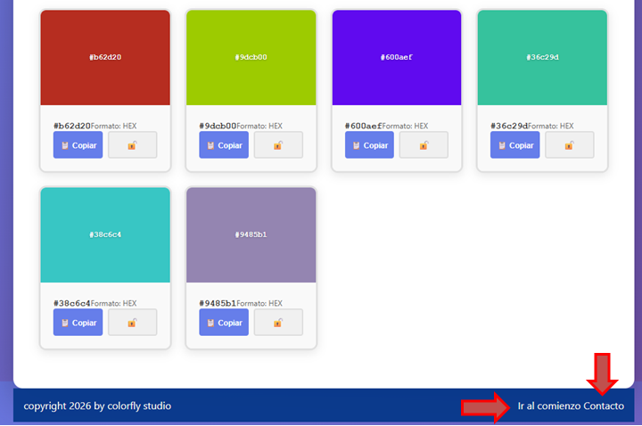

# 🎨 Generador de Paletas de Colores by Colorfly Studio
Una aplicación web moderna e interactiva que genera paletas de colores aleatorias en formatos HEX y HSL, y funciona perfectamente en todos los dispositivos.

**visita el sitio** **    https://sergioojeda349-dev.github.io/ProyectoM1_SergioOjeda-/

## ✨ Características Principales

•
✅ Generación de colores aleatorios en formatos HEX y HSL

•
✅ Selección de tamaño: 6 u 8 colores por paleta

•
✅ Copiar códigos al portapapeles con un clic

•
✅ Bloqueo de colores: Mantén colores específicos mientras regeneras la paleta

## 🔧 Tecnologías Utilizadas

•
HTML5

•
CSS3

•
JavaScript

## 📁 Estructura del Proyecto

## 🚀 Cómo Empezar

1 • **Clonar el repositorio:** git clone https://github.com/sergioojeda349-dev/ProyectoM1_SergioOjeda-

2 • **Ingresar a la carpeta del proyecto:** ProyectoM1_SergioOjeda-

3 • **Abrir el archivo index.html en el navegador**.

También podés usar la extensión Live Server en VS Code.

## 💻 Cómo Usar la Aplicación

Paso a Paso

1. **Selecciona el tamaño de la paleta**

    •6 colores: Se distribuyen en dos filas

    •8 colores: Se distribuyen en dos filas de 4

2. **Elige el formato de los códigos**

    •HEX: Formato hexadecimal (#RRGGBB)

    •HSL: Formato HSL (hue, saturation, lightness)

3. **Haz clic en "🔄 Generar Paleta"**

    •Se generarán colores aleatorios

    •Los colores bloqueados se mantienen

4. **Interactúa con las tarjetas**

    •📋 Copiar: Copia el código al portapapeles

    •🔓/🔒: Bloquea/desbloquea el color para futuras generaciones

5. **Recibe feedback**

    •Notificaciones Toast confirman cada acción

    •El botón de copiar cambia a verde momentáneamente

6. **Se agregaron botones**

    •Ir al comienzo
    
    •Contacto

    

  ## 📖 Prompt utilizados con la IA hacer clic abajo
  [Ver documentación](assets/promptIA)

## 📈 Próximas mejoras
🌈 Selector de colores manual.

❤️ Sistema de favoritos.
  
🎯 Exportar paletas como imagen PNG.

🌙 Modo oscuro.

🎨 Generación de paletas armónicas.

🎛️ Personalización de saturación y luminosidad.

## 👨‍💻 Autor

Creado con ❤️ por Sergio Ojeda

desarrollador Full Stack en formación.

